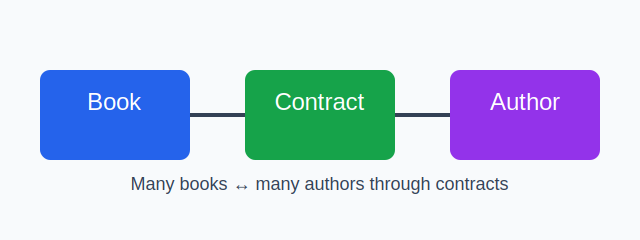

# Book and Author Contract Lab

This project models a many-to-many relationship between books and authors using a contract join model. Authors can sign contracts for many books, and books can have many authors through those contracts.

## What the app does

- Creates Book objects with titles
- Creates Author objects with names
- Creates Contract objects that link authors to books with a date and royalty value
- Exposes relationship helpers so you can traverse from a book to its authors and from an author to their books
- Calculates total royalties for each author
- Filters contracts by date

## Project structure

- lib/many_to_many.py: the model implementation
- lib/testing/test_many_to_many.py: the test suite for the relationships

## Example usage

```python
from many_to_many import Author, Book, Contract

author = Author("Jane Austen")
book = Book("Pride and Prejudice")
contract = author.sign_contracts(book, "01/01/2001", 50000)

print(author.books())
print(book.authors())
print(author.total_royalties())
```

## Relationship overview



## Development notes

The implementation uses a Contract class as the join model between Book and Author. Each relationship is stored in the Contract registry, and the helper methods read from that shared registry so the relationships stay consistent.

## Testing

Run the test suite with:

```bash
pytest -q
```

